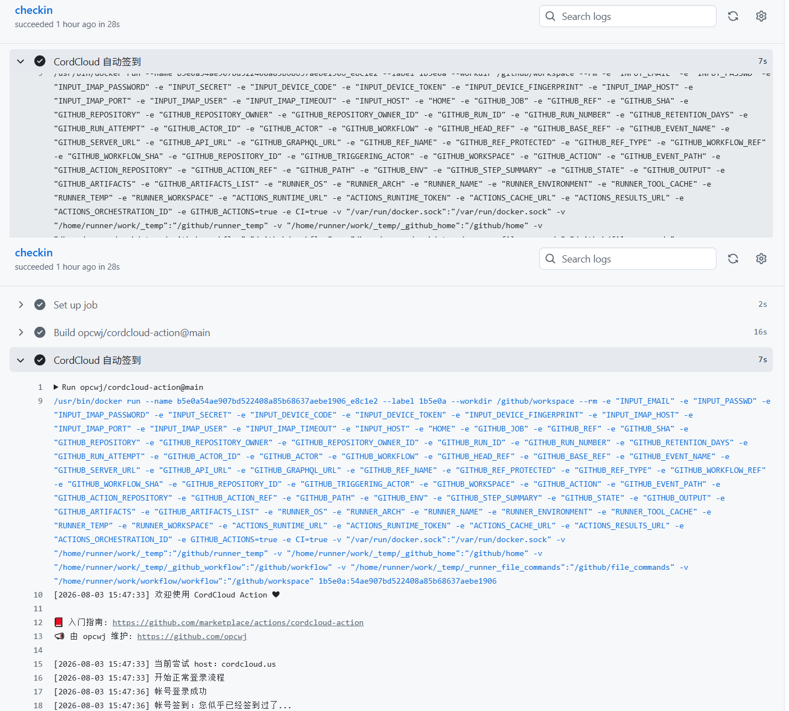

# CordCloud Action

<a href="./LICENSE"></a> <a href="../../releases"></a>

CordCloud 帐号自动续命。可配置 workflow 的触发条件为 `schedule`，实现每日自动签到，领取流量续命。

欢迎 Star ⭐ 关注[本项目](https://github.com/opcwj/cordcloud-action)，若有体验上的问题，欢迎提交 issues 反馈给我。你也可以将本项目 Fork
到你的个人帐号下，进行自定义扩展。

本项目基于[yanglbme/cordcloud-action](https://github.com/yanglbme/cordcloud-action)修改，在此特别鸣谢！！因CordCloud登录签到验证逻辑改变，故此修改。

## 入参

| 参数     | 描述                   | 是否必传                                                                                                                                          | 默认值                                                   | 示例                      |
| -------- | ---------------------- |---------------------------------------------------------------------------------------------------------------------------------------------------| -------------------------------------------------------- | ------------------------- |
| `email`  | CordCloud 邮箱         | 是                                                                                                                                                |                                                          | \${{ secrets.CC_EMAIL }}  |
| `passwd` | CordCloud 密码         | 是                                                                                                                                                |                                                          | \${{ secrets.CC_PASSWD }} |
| `secret` | CordCloud 两步验证密钥 | 否                                                                                                                                                |                                                          | \${{ secrets.CC_SECRET }} |
| `host`   | CordCloud 站点         | 否                                                                                                                                                | cordcloud.us,cordcloud.one,<br>cordcloud.biz,c-cloud.xyz,cordc.xyz |                           |
| `device_code` | 陌生设备邮箱验证码（仅首次触发时需填一次） | 否                                                                                                                                                |                                                          |                           |
| `device_token` | 首次触发时日志输出的验证 token（与 `device_code` 一起填，避免重发验证码作废旧码） | 否                                                                                                                                                |                                                          |                           |
| `device_fingerprint` | 自定义设备指纹（可复用已验证过的值） | 否                                                                                                                                                | 由邮箱生成的稳定指纹                                    |                           |
| `imap_host` | IMAP 服务器（留空则按邮箱域名自动识别） | 否                                                                                                                                                | 自动识别                                              | imap.gmail.com            |
| `imap_port` | IMAP 端口 | 否                                                                                                                                                | 993                                                    |                           |
| `imap_user` | IMAP 用户名（默认用邮箱） | 否                                                                                                                                                | 邮箱                                                   |                           |
| `imap_password` | IMAP 密码/应用专用密码（用于自动读取验证码） | 否（**推荐填写，用于自动读取邮箱验证码并提交验证。避免需要验证码验证时登录失败而无法签到，省去设备过期需要手动配置邮箱验证码device_code的时间**） |                                                          | \${{ secrets.CC_IMAP_PWD }} |
| `imap_timeout` | IMAP 自动读取验证码的超时时间（秒） | 否                                                                                                                                                | 120                                                    |                           |

注：

- **全自动（推荐）**：配置 `imap_password`（邮箱 IMAP 密码/应用专用密码）后，触发陌生设备验证时会**自动从邮箱读取验证码并完成验证**，无需手动填写 `device_code`，一次运行即可完成登录+签到。注意：Gmail 等需使用应用专用密码，并确保邮箱已开启 IMAP 服务。
最简配置可直接参考仓库中的 [`action-simple.yml`](./action-simple.yml)（只需配置邮箱、密码与 IMAP 密码即可全自动签到）！！！


--- 
**【签到有问题，或想深入了解的可继续阅读下文】**

- `host` 支持以英文逗号分隔传入多个站点，CordCloud Action 会依次尝试每个站点，成功即停止。若是遇到帐号或密码错误，则不会继续尝试剩余站点。
- 如果你设置了两步验证，需要将两步验证的密钥传入，否则无法正常签到。
- **陌生设备验证（一次性）**：CordCloud 会根据 `device_fingerprint` 识别设备。Action 默认使用由邮箱生成的稳定指纹，跨机器、跨时间恒定。首次运行时若服务器识别为陌生设备（`检测到陌生设备，需要进行二步验证`），会向邮箱发送验证码，此时只需将验证码填入 `device_code` 再运行一次即可。验证成功后该指纹将被永久信任，之后**永不再触发**验证。
- **注意**：首次触发后会向邮箱发送验证码并保存一个 `token`。请在**下一次运行前**设置好 `device_code`（必要时同时设置 `device_token`），**期间不要再次运行**，否则每次登录都会重发验证码并作废前一个验证码。成功验证后 token 会自动清除。


## 简单配置示例

### 1. 创建 workflow

在你的任意一个 GitHub 仓库 `.github/workflows/` 文件夹下创建一个 `.yml` 文件，如 `cc.yml`，推荐配置内容如下：
（完整配置说明参考上表`入参`或[action.yml](action.yml)）
```yml
name: CordCloud 签到

on:
  schedule:
    # cron 为 UTC 时间，每天 UTC 0 点运行（北京时间早上 8 点，可按需调整）
    - cron: "0 0 * * *"
  workflow_dispatch:

jobs:
  checkin:
    runs-on: ubuntu-latest
    steps:
      - name: CordCloud 自动签到
        uses: opcwj/cordcloud-action@main
        with:
          email: ${{ secrets.CC_EMAIL }}
          passwd: ${{ secrets.CC_PASSWD }}
          # IMAP 密码/应用专用密码：触发陌生设备验证时自动读取验证码，一次运行即可登录+签到
          imap_password: ${{ secrets.CC_IMAP_PWD }}
```

如果你设置了两步验证，需要将两步验证的密钥传入，否则无法完成登录签到。示例如下：

```yml
name: CordCloud 签到

on:
  schedule:
    # cron 为 UTC 时间，每天 UTC 0 点运行（北京时间早上 8 点，可按需调整）
    - cron: "0 0 * * *"
  workflow_dispatch:

jobs:
  checkin:
    runs-on: ubuntu-latest
    steps:
      - name: CordCloud 自动签到
        uses: opcwj/cordcloud-action@main
        with:
          email: ${{ secrets.CC_EMAIL }}
          passwd: ${{ secrets.CC_PASSWD }}
          # IMAP 密码/应用专用密码：触发陌生设备验证时自动读取验证码，一次运行即可登录+签到
          imap_password: ${{ secrets.CC_IMAP_PWD }}
          secret: ${{ secrets.CC_SECRET }}
```

注意：`cron` 是 UTC 时间，使用时请将北京时间转换为 UTC 进行配置。由于 GitHub Actions 的限制，如果将 `cron` 表达式设置为 `* * * * *`，则实际的执行频率为每 5 分钟执行一次。

```bash
┌───────────── 分钟 (0 - 59)
│ ┌───────────── 小时 (0 - 23)
│ │ ┌───────────── 日 (1 - 31)
│ │ │ ┌───────────── 月 (1 - 12 或 JAN-DEC)
│ │ │ │ ┌───────────── 星期 (0 - 6 或 SUN-SAT)
│ │ │ │ │
│ │ │ │ │
│ │ │ │ │
* * * * *
```

实际上，一般情况下，你只需要跟示例一样，将 `cron` 表达式设置为**每天定时运行一次**即可。如果担心 CordCloud 官网某次恰好发生故障而无法完成自动签到，可以将 `cron` 表达式设置为一天运行 2 次或者更多次。

### 2. 配置 secrets 参数

在 GitHub 仓库的 `Settings -> Secrets` 路径下配置好 `CC_EMAIL` 、`CC_PASSWD`和`CC_IMAP_PWD`，不要直接在 `.yml` 文件中暴露个人帐号密码以及密钥等敏感信息。

如果你设置了两步验证，注意还需要配置 `CC_SECRET` 参数。


### 3. 每日运行结果

若 CordCloud Action 所需参数 `email`、`passwd` 等配置无误，CordCloud Action 将会根据触发条件（比如 `schedule`）自动运行，结果如下：



```bash
Run opcwj/cordcloud-action@main
/usr/bin/docker run --name b5e0a54ae907bd522408a85b68637aebe1906_e8c1e2 --label 1b5e0a --workdir /github/workspace ......
[2026-08-03 15:47:33] 欢迎使用 CordCloud Action ❤

📕 入门指南: https://github.com/marketplace/actions/cordcloud-action
📣 由 opcwj 维护: https://github.com/opcwj

[2026-08-03 15:47:33] 当前尝试 host：cordcloud.us
[2026-08-03 15:47:33] 开始正常登录流程
[2026-08-03 15:47:36] 帐号登录成功
[2026-08-03 15:47:36] 帐号签到：您似乎已经签到过了...
[2026-08-03 15:47:39] 帐号流量使用情况：今日已用 2.17GB, 过去已用 7.26GB, 剩余流量 342.67GB
[2026-08-03 15:47:39] CordCloud Action 成功结束运行！
```
